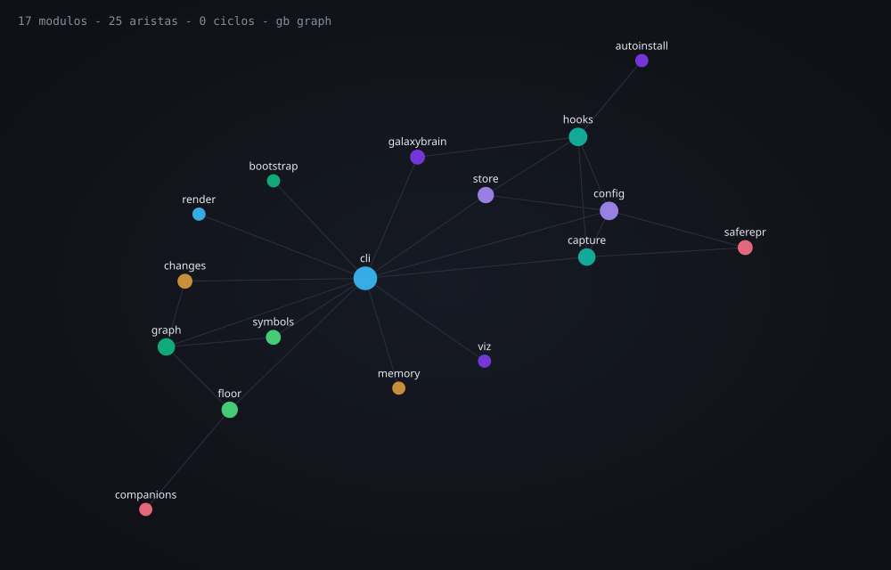

<p align="center">
  
</p>

# galaxy-brain

> **When something crashes, it tells you where and with what state — without you reproducing it by hand.**

That is the spine: an error console. Around it, the same discipline applied to other deterministic
facts about your code — what shape it has (`graph`/`symbols`/`calls`), what each change did to it
(`check`), what foundation it is missing (`floor`), what was learned across repos (`memory`).

**One tool, `gb`.** A single Python package, **zero model calls** on the hot path, **zero
dependencies** beyond the standard library. An exception is a fact; the state at the moment of
failure is a fact; the shape of the import graph is a fact. Reporting facts requires no judgment,
which is why it can be instant and cannot fail in expensive ways.

<sub>v0.3.0 · 445 tests · 8.4k LOC source / 6.4k LOC tests · clean gate · ruff · Python ≥ 3.9 · zero runtime dependencies · CLI output is in Spanish today</sub>

---

## Table of contents

- [What this is, and what it is not](#what-this-is-and-what-it-is-not)
- [What it saves you](#what-it-saves-you)
- [Installation](#installation)
- [Day one](#day-one)
- [Command reference](#command-reference)
- [The error console](#the-error-console)
- [The map](#the-map)
- [What a change did](#what-a-change-did)
- [The floor](#the-floor)
- [Cross-repo memory](#cross-repo-memory)
- [Wired into the agent](#wired-into-the-agent)
- [How it is verified](#how-it-is-verified)
- [Cost, measured](#cost-measured)
- [Settings](#settings)
- [Secrets](#secrets--redaction-by-name-with-an-honest-residue)
- [Known limits, stated up front](#known-limits-stated-up-front)
- [The design law](#the-design-law)
- [Development](#development)
- [Documents](#documents)

---

## What this is, and what it is not

**It is a verification harness for people and agents who work on Python code.** Its job is to answer
questions that have exact answers — where did this die, with what values, who calls this function,
what did that diff move, is there a new import cycle — and to answer them in milliseconds, offline,
with no model in the loop and nothing to configure.

**It is not an autonomous agent, a linter with opinions, or a code reviewer.** It does not decide
whether your code is good. Almost everything it prints is something you asked for and can act on;
the two things that can stop a commit are facts, not judgments (a new import cycle, a crossing of a
boundary you declared yourself). Everything that is merely a *proxy* for quality — coupling
churn, test-shape signals, over-engineering smells — informs and never blocks. That distinction is
rule 11, and it exists because gating proxies is what sank the previous version of this project:
false positives train people to type `--no-verify`, and after that the gate protects nothing.

Concretely, gb is useful when:

- a script, CLI, worker or server died while you were not watching, and you would otherwise re-run
  it with `print` statements to find out why;
- you are about to change a function and need to know who depends on it before you grep;
- you want a diff's blast radius before review, not after;
- you are starting a repo and want the scaffolding that makes later work checkable;
- you (or an agent) keep re-learning the same fact in every session.

It is **not** useful for failing tests: pytest catches the exception itself, so it never reaches
`sys.excepthook` and gb records nothing. Use `pytest -l` — it prints the locals of every frame,
which is the same information. This negative result is written down in
[docs/pruebas-de-uso.md](docs/pruebas-de-uso.md) rather than hidden.

The scope is closed on purpose, and the list of what it deliberately refuses — including why it is
**not** an MCP server — is in [SCOPE.md](SCOPE.md).

---

## What it saves you

A traceback tells you **where**. This also tells you **with what**:

```
KeyError: 'empresa'
hace 1min · facturacion/precios.py:6 · mi-api

  facturacion/precios.py:6  in precio_total
         4 |
         5 | def precio_total(cliente, cupon=None):
   →     6 |     base = TARIFAS[cliente["plan"]]
         7 |     unidades = cliente["asientos"]
         8 |     return base * unidades

      cliente = {'nombre': 'Beto', 'plan': 'empresa', 'asientos': 12}
      cupon   = None
```

The step that disappears is relaunching the program with a `print` in it. The failure happens once,
often while you are not looking; reproduction is the expensive work this removes.

---

## Installation

```bash
pip install -e .     # from this repo
gb on                # enables capture in this Python environment
gb status            # verifies it stuck
```

`gb on` drops a `.pth` file into site-packages. From then on **there is nothing to remember**: every
Python process in that environment is covered, without touching any project's code.

Bringing it to another project is one command, with that project's venv active:

```bash
# bash / WSL
pip install -e <path-to-this-repo> && gb on && gb status

# Windows — instala.ps1 does exactly that, no paths to type (it locates itself)
powershell -ExecutionPolicy Bypass -File <path-to-this-repo>\instala.ps1
```

Coverage is **per Python environment, not per repo**. Being editable (`-e`), a `git pull` here
updates every environment with no reinstall. To remove it: `gb off` — one line, no residue. Cheap
removal is deliberate (rule 10: abandonment is data, not something to armor against).

---

## Day one

```bash
git init my-project && cd my-project
gb floor        # the floor: what is missing before you build, and why each piece matters
gb floor --init # drops the base documents — and the pre-commit hook
```

On a fresh git repo the session map suggests this path by itself — one line, only in the
unambiguous case (git present, no code, no floor docs), silence otherwise. `--init` leaves seven
pieces, never overwriting anything:

| Piece | Why it is there |
|---|---|
| `AGENTS.md` | Executable context in the cross-tool format read by Claude Code, Codex, Cursor, Copilot and Aider — including the gb usage contract for agents |
| `SCOPE.md` | What is in, what is out, and the done criterion |
| `ARCHITECTURE.md` | The design law, so later decisions have something to cite |
| `docs/adr/README.md` | An ADR folder in [MADR](https://adr.github.io/) form: one file per decision that was expensive to make |
| `docs/evidencia.md` | The evidence log, so choices cite measured numbers instead of folklore — including the failures, because a project that records only what worked has advertising, not evidence |
| `.githooks/pre-commit` | The gate wired in **ratchet mode**: inherited debt does not block, only new debt does. Hook it once with `git config core.hooksPath .githooks` |
| `.claude/settings.json` | Wires the agent at project level — session map, edit delta and symbol cards travel with the repo, merging with each machine's own settings |

One thing no tool can write for you, and gb says so out loud: the **done criterion** in SCOPE.md.
You write it before the first line of code, because not knowing when to stop is the number one
cause of over-engineering, and the cure costs one sentence.

---

## Command reference

Twelve subcommands, and every one belongs to a family. A command that does not fit a family does not
ship — there is no "small exception", because small exceptions are exactly how a monster gets built.

### Where it crashed, and with what state

| Command | What it does |
|---|---|
| `gb last` | This project's latest failure, with its state |
| `gb last --full` | The same, with every frame kept |
| `gb list -n 20` | The history grouped by signature: what breaks, and how often |
| `gb list --chrono` | The raw timeline, most recent first |
| `gb list --all` | Every project, not just this one |
| `gb list --efimeros` | Include `python -c` / stdin captures (hidden by default, and said so) |
| `gb show <id>` | One specific failure — the id comes in the capture notice |
| `gb on` / `gb off` | Enable / disable capture in this environment |
| `gb status` | What is active right now, and how many captures are unread |
| `gb status --cobertura` | Runs 8 real failure modes and shows which ones leave a record |

### What shape it has

| Command | What it does |
|---|---|
| `gb graph <path>` | Coupling map: imports, cycles, hotspots |
| `gb graph --gate` | Exit code ≠ 0 on cycles or declared-boundary crossings — for pre-commit |
| `gb graph --gate --since HEAD` | Ratchet: only **new** debt fails |
| `gb graph --boundaries FILE` | Layering rules (defaults to `.gb-boundaries` at the root) |
| `gb graph --smells` | Over-engineering proxies — **advisory, never blocks** |
| `gb graph --self-test` | Injects known defects and fails if the gate does **not** see them |
| `gb graph --context` | The compressed map as a session payload; silent when there is nothing to say |
| `gb graph --html F --open` | The navigable canvas |
| `gb symbols <path>` | Symbol graph: who calls whom, with its resolution coverage |
| `gb symbols --html F --watch` | The **live** map: regenerates whenever any `.py` changes |
| `gb symbols --capas` | Layered view instead of the cloud |
| `gb symbols --since REF` | What grew since that ref, marked apart |
| `gb calls <symbol>` | Callers and callees of a symbol, with `file:line` |
| `gb calls <symbol> --depth 2` | The wave: also who calls the callers |
| `gb calls --hook` | PreToolUse mode: reads hook JSON from stdin, silent when there is nothing |

Shared flags worth knowing: `--json` on every command for raw output, `--if-changed` to skip
rewriting HTML when the shape did not move (cheap for a hook), `--refresco N` for browser
self-reload, `--fondo` to detach `--watch` as an independent process.

### What each change did

| Command | What it does |
|---|---|
| `gb check` | What a diff did to tests, coupling, and its wave (default range `HEAD~1..HEAD`) |
| `gb check --staged` | Reviews the index instead of a range — the only correct thing in a pre-commit |
| `gb check --brief` | One line when there are no signals, for hooks |

`check` **informs and never blocks.** Its signals are proxies, and proxies that gate manufacture the
false positives that end in `--no-verify`.

### What it is missing at the base

| Command | What it does |
|---|---|
| `gb floor` | The minimum scaffolding a project needs before building |
| `gb floor --init` | Drops the seven base pieces, never overwriting |
| `gb floor --time` | Times the suite against the DORA threshold — runs the tests, so it is opt-in |

### What was learned, across repos

| Command | What it does |
|---|---|
| `gb memory index` | The compact index, one line per note |
| `gb memory recall <words>` | Full text of the most relevant notes |
| `gb memory context` | The session payload (what the `SessionStart` hook calls) |
| `gb memory add --name x --description "..." --scope always` | Add or overwrite a note (body via `--body` or stdin) |

---

## The error console

With no arguments, `gb last` and `gb list` filter by the repo you are standing in. And the failure
card ends **in the graph** — the crash anchored to the symbol whose body contains the line, with
its blast wave one command away:

```
en el grafo: lib.base · function · lib.py:5
  le llaman (1): lib.ayuda
```

The anchor is honest about time: it resolves against **today's** code, and if the file changed
after the capture it says so, with the exact commit — instead of silently pointing at whatever
occupies that line now.

**One failure type, three exit doors.** "Uncaught exception" is not a synonym for `sys.excepthook`:
the interpreter lets failures out through three doors, and all three are covered.

| Door | When | Status |
|---|---|---|
| `sys.excepthook` | The exception kills the main thread and the process | covered |
| `threading.excepthook` | It kills a `threading` thread; the process lives on | covered (`GB_NO_THREADS=1` opts out) |
| `sys.unraisablehook` | Python **could not** propagate it: `__del__`, weakrefs, GC | covered |

The third door was the only one that vanished **without a trace**: the interpreter prints it, the
process does not die, and nothing was left to show. None of the three costs anything while your
program works.

**What triggers a capture and what does not — executed, not documented:**

```bash
gb status --cobertura   # runs 8 real failure modes and shows which leave a record
```

```
LO QUE SI deja registro          LO QUE NO (y es correcto)
  + excepcion no capturada          - asyncio: tarea suelta que nadie espera
  + excepcion en un hilo            - sys.exit(1)
  + excepcion en __del__            - KeyboardInterrupt
  + asyncio fuera de run()          - excepcion atrapada por try/except
```

The boundary is not documented — documents age. It is **demonstrated** every time you run it.

The history lives in `~/.galaxy-brain`, append-only, **outside the observed repo**: the harness never
dirties the project it is watching (rule 7).

---

## The map

<p align="center">
  
</p>

The other half of the surface: what shape the project has and who calls whom. All deterministic,
zero models, zero dependencies — same facts, different views. **`graph --html` and `symbols --html`
lead to the same page**: modules, symbols, imports and calls on one navigable canvas.

A symbol card carries everything an agent needs to **call code it has not read** — the signature
straight from the AST (args, defaults, `*`, `async`, the decorators that change the call), where it
lives, what it does (first docstring line), and who depends on it, with sources split from tests:

```
galaxybrain.store.parse_ts(value) · function · src\galaxybrain\store.py:270 — El `ts` de una entrada…
  le llaman (7 — 6 de src, 1 de tests):
```

Clicking a node answers with **facts**: its description (taken from the docstring, not from a
model), who calls it, whom it calls, what it imports, whether it sits in a cycle — plus the layers
of history: the error-cycle rings (captured → read → intervened → silent) and a halo on whatever is
**in progress**, uncommitted, right now. Imports are drawn differently from calls because **an
import is exact and a call is inferred** — merging them into one number would mean gating on a
proxy.

Two honest numbers ship with every run: `gb symbols` **declares what it could not resolve**
(`object.method()` calls require type inference, and here nothing is guessed: a false edge gets
believed, a missing one gets noticed), and measured against an inference-based index it scores
**93% recall** with zero dependencies. Details and the negative results live in
[docs/pruebas-de-uso.md](docs/pruebas-de-uso.md).

The graph is **always derived, never persisted.** A stored map is a map that goes stale and lies;
recomputation is fast enough that caching would buy milliseconds and cost correctness.

---

## What a change did

```bash
gb check --staged      # before committing
gb check HEAD~5..HEAD  # what the last five commits moved
```

It reports what a diff did to the tests, to coupling, and to the blast wave of the symbols it
touched. Its whole output is advisory. The one thing in this area that *can* stop a commit lives in
`graph --gate`, and only for two facts: a **new** import cycle, or a crossing of a boundary you
declared in `.gb-boundaries`.

---

## The floor

`gb floor` reads a repo and reports what scaffolding is missing before you build — and, for each
piece, why it matters. It is not a template generator: `--init` never overwrites, and the one thing
it cannot write for you (the done criterion) it tells you to write yourself.

---

## Cross-repo memory

A fact learned in one repo should not die there. `gb memory` is a vault of durable markdown notes
(in `~/.claude/memory-global`, hand-editable, with `[[wikilinks]]` so Obsidian opens the graph)
that surface in **any** project via a `SessionStart` hook.

Lean by design: session start injects the index of **all** notes but the full text only of `always`
notes and this project's; the rest is pulled on demand with `recall`. The vault is never dumped
whole — context is the scarce resource, and spending it on notes nobody asked for is the failure
mode this design avoids.

---

## Wired into the agent

Three hooks make the graph ambient, so the agent asks the graph instead of opening files:

| Hook | What it injects | Measured |
|---|---|---|
| `SessionStart` | The compressed map, plus a count of unread captures when there are any | ~110 tokens, 162 ms |
| After each edit | Only what **changed** — or silence | under the 1 s edit budget |
| On every code search | The matching symbol cards ride along (`gb calls --hook`) | 430 ms here, 330 ms on a 600-module synthetic repo |

All of it ships **per project**: `gb floor --init` drops the wiring, so a fresh clone gets an aware
agent with no global setup. The model does not know gb exists; **its context does.** That is the
point — a rule that depends on someone remembering a flag eventually fails, so the correct behavior
has to be what happens when you type nothing.

Meanwhile `gb symbols … --html m.html --watch` keeps the human's map fresh in the browser,
atomically, using nothing but the filesystem.

---

## How it is verified

Three layers, because tests alone only pin what you already knew how to check.

**1. The suite — 445 tests, ~30 s.** Runs on every commit via the pre-commit hook, far under the
600 s DORA threshold.

**2. The gate is verified by breaking it.** A gate degrades in silence: it keeps returning zero and
stops looking at anything.

```bash
gb graph --self-test        # injects 6 known defects and fails if the gate does NOT see them
gb graph src --self-test    # additionally: relations that must hold on YOUR code
```

**3. Metamorphic relations — "these two ways of asking must agree"**, evaluated on your real repo:
the same folder spelled `c:` or `C:` yields the same shape; a cycle's imports are edges that exist;
`graph` and `symbols` see the same modules. That is where most of the real defects lived.

**4. Behavior is demonstrated, not asserted.** `gb status --cobertura` executes eight failure modes
and shows which leave a record. A document claiming the same thing would eventually be wrong without
anyone noticing.

---

## Cost, measured

The budget is measured, not estimated (rule 4). Python 3.11, Windows 10, median of 20 cold starts:

| | |
|---|---|
| Clean interpreter startup | 21.2 ms |
| With the hook installed | 27.7 ms |
| **Hook cost** | **6.4 ms** (A/B measured: 5.2 ms) |
| — of which, `import threading` | 5.2 ms |

**While your program works, the cost is zero.** Not "low": zero. The hooks only run once the
process has already failed. For a tiny CLI that never touches threads: `GB_NO_THREADS=1`.

Other measured numbers: session map ~110 tokens in 162 ms · `symbols` 93% recall · search hook
430 ms (this repo) / 330 ms (600 synthetic modules) · `gb show` with anchor 158 ms · ruff 130 ms ·
the suite in ~30 s.

The budget is architecture, not performance: **< 1 s per edit, < 10 s per commit.** Exceeding it is
a design violation to be fixed by removing something, not an optimization task for later.

---

## Settings

Everything via environment variables; there is no config file to maintain.

| Variable | Default | What it does |
|---|---|---|
| `GB_DISABLE` | off | Turns capture off without uninstalling anything |
| `GB_QUIET` | off | Silences the one-line notice printed after the traceback |
| `GB_HOME` | `~/.galaxy-brain` | Where the history lives |
| `GB_NO_THREADS` | off | Skip thread exceptions (saves 5.2 ms of startup) |
| `GB_ALL_FRAMES` | off | Also keep locals of library frames |
| `GB_MAX_FRAMES` | 20 | Frames kept (innermost survive) |
| `GB_CONTEXT_LINES` | 2 | Source lines around the failing one |
| `GB_OPEN_CMD` | browser | What opens the map (`--open`); receives the path as last argument |

`GB_OPEN_CMD` exists because gb **knows no editor** and will not maintain a list: a hardwired
command is a bug (rule 6 — nothing project-specific, everything detected at runtime). Point the map
wherever you want (`GB_OPEN_CMD="firefox --new-window"`).

---

## Secrets — redaction by name, with an honest residue

The state around a failure is exactly where credentials live. The console **redacts by name**
(`password`, `token`, `api_key`, `secret`, `auth`, `credential`, `session`, `cookie`…). The trigger
is always the **name**, never the content: guessing whether a string is a secret is expensive and
fallible; the name was written by a human, on purpose.

**The residue, said plainly:** a secret **without a sensitive name next to it** reaches disk — a
positional literal (`connect("hunter2")`), a password inside a URL (`user:pass@host`), a secret
value under an innocent name. Closing that would require content heuristics, which this project
rejects deliberately because they fail and sell false safety. That is why the golden rule does not
depend on redaction: **the history lives in your `$HOME` in plain text; treat it as sensitive and
upload it nowhere.**

---

## Known limits, stated up front

- **Uncaught exceptions only.** An `except: pass` that swallows the failure is invisible here — and
  rightly so: a handled exception is, by definition, one its author decided was not a failure.
- **Failing tests are not covered.** pytest catches the exception, so no hook ever sees it. Use
  `pytest -l`.
- **Main thread, `threading` threads, and finalizers** (`__del__`, weakrefs, GC). **`asyncio` with
  stray tasks** nobody awaits stays out, as does `multiprocessing`; if the exception propagates out
  of `asyncio.run()`, it is captured.
- **No source file, no code context.** `python -c`, `exec()` and the REPL keep type, message,
  frames and state, but not the surrounding lines (`gb list` sets them apart as ephemeral).
- **The state is the state at death**, not a time-travel debugger.
- **Unrepresentable objects are described, not reconstructed.** A `__repr__` that blows up leaves
  `<Type: repr() failed with X>` and does not take the rest of the frame down with it.
- **Non-Python deaths** — a segfault, an OOM kill, a `kill -9` — raise no exception, so no hook
  ever sees them.
- **Python only, local only.** No CI, no UI, no server, no MCP server (see [SCOPE.md](SCOPE.md) for
  why, and for the single condition that would reopen it).
- **Call edges are inferred.** `object.method()` needs type inference; unresolved calls are
  declared, not guessed.
- **Adoption is the one thing not measured.** Latency, overhead, recall and coverage all have
  numbers behind them. Whether people keep using it does not — and by rule 10, if you stop, that
  gets investigated, never blocked with a hook that forces you back.

---

## The design law

Eleven rules, in [ARCHITECTURE.md](ARCHITECTURE.md); a change that violates one is rejected in
review rather than argued about. The load-bearing ones:

1. **Zero models on the hot path.** Capturing, storing, showing and analyzing consult nobody.
2. **Return, don't rule.** Every run ends by handing over something the user wanted. A function
   whose only output is a verdict is misplaced — anything that only says *no* is a tax.
3. **Latency budget, non-negotiable.** < 1 s per edit, < 10 s per commit.
4. **Overhead on the observed process measured, not estimated.**
5. **One language, one runtime.** Python, local, one failure type.
6. **Facts stored raw.** Exception, trace and state persist exactly as captured.
7. **History local, append-only, outside the observed repo.**
8. **AI only after the fact, explicit and optional.**
9. **Fail silently toward the safe side.** If capture breaks, the observed program continues as if
   gb were not installed.
10. **Abandonment is data, not a bug to armor against.**
11. **Proxies inform, they don't block.** Only facts gate.

Two working principles sit above all of them: **subtract before you polish** (maintenance cost does
not grow with size, it grows worse — every part rubs against every other, so the first question
about a problem is what to remove), and **evidence over folklore** (a decision cites a measured
fact; "other frameworks do it" is not a reason).

---

## Development

```bash
python -m pytest tests/ -q          # the suite — 445 tests, ~30 s
python -m ruff check src tests      # lint (catches defects, holds no style opinions)
gb graph src --gate                 # the gate, clean
```

The pre-commit ([.githooks/pre-commit](.githooks/pre-commit)) runs lint + suite + gate + `gb check
--staged` in < 10 s; hook it once with `git config core.hooksPath .githooks`. `git commit
--no-verify` skips it — and that skip is a datum, not a rule.

The console's layering rules live in [src/.gb-boundaries](src/.gb-boundaries): the core (capture,
store, analysis) does not import the presentation (`cli`, `render`, `viz`). A new crossing stops
the commit; a test-softening signal only informs.

Commits are `type: short description` (`feat`, `fix`, `refactor`, `docs`, `chore`), one logical
change each, with behavior changes and documentation changes kept apart.

---

## Documents

| Document | What it holds |
|---|---|
| [ARCHITECTURE.md](ARCHITECTURE.md) | The design law: the thesis, the command families, the eleven rules |
| [SCOPE.md](SCOPE.md) | What is in, what is deliberately out, the done criteria per family, and the failure criteria written while they do not hurt yet |
| [docs/research-report.md](docs/research-report.md) | The measured evidence decisions cite |
| [docs/pruebas-de-uso.md](docs/pruebas-de-uso.md) | The usage notebook, including the negative results |
| [CLAUDE.md](CLAUDE.md) | The contract for agents working in this repo |

Decision documents are in Spanish for coherence; anything published is in English.
