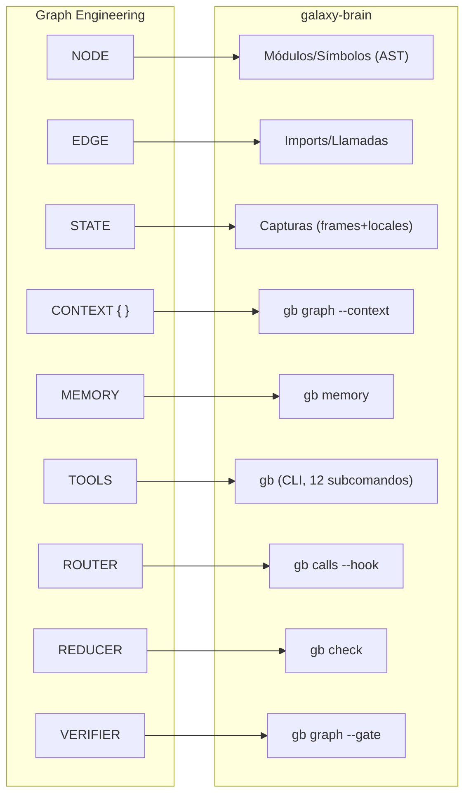

# Graph Engineering — Transcripción y Análisis de Compatibilidad con galaxy-brain

> **Fecha:** 5 de agosto de 2026
> **Fuente:** Diagrama "Graph Engineering" (cheat sheet) — [el original](graph-engineering-diagrama.jpg);
> la sección I es su transcripción
> **Contexto:** Análisis de relevancia para [galaxy-brain](../README.md)

---

## I. Transcripción del Diagrama

### I. OVERVIEW

Graph Engineering trata los sistemas como **grafos de entidades y relaciones**, no como secuencias
lineales.

Permite razonamiento paralelo, toma de decisiones local y adaptación continua con **coherencia
global**.

El resultado son sistemas que evolucionan con contexto manteniendo alineación, fiabilidad y
observabilidad.

*"Different abstraction. Different results."*

---

### II. REFERENCE ARCHITECTURE

Flujo vertical:

```
USER GOAL
  Contexto, restricciones, preferencias
       │
       ▼
GRAPH ORCHESTRATOR
  Planifica, enruta y adapta
  Build │ Evolve │ Route │ Adapt │ Evaluate
       │
       ▼
GRAPH COMPONENTS
  ┌──────────┬──────────┬──────────┬──────────┐
  │ AGENTS   │ TOOLS    │ DATA     │ GOALS    │
  │ Actúan   │ Funciones│ Memoria, │ Optimizan│
  │ con cap. │ APIs,    │ archivos,│ para obj.│
  │ especial.│ integr.  │ conocim. │ y result.│
  └──────────┴──────────┴──────────┴──────────┘
       │
       ▼
EXECUTION LAYER
  Ejecuta en paralelo, gestiona contexto,
  programa trabajo, maneja fallos
       │
       ▼
OBSERVABILITY & FEEDBACK
  Logs, métricas, trazas, evaluaciones
  Alimenta el grafo e impulsa adaptación
```

---

### III. CORE PRINCIPLES

| Principio | Descripción |
|---|---|
| **Graph Over Line** | Modela el sistema como un grafo, no una secuencia |
| **Local Decisions, Global Coherence** | Los nodos deciden localmente; el grafo asegura alineación |
| **Composability** | Componentes modulares. Los grafos son componibles |
| **Fault Tolerance** | Caminos redundantes y rutas alternativas mantienen el sistema resiliente |
| **Observability by Design** | Todo es observable, todo es trazable |
| **Continuous Adaptation** | El grafo evoluciona con contexto, feedback y resultados |

---

### IV. GRAPH TOPOLOGY PATTERNS

| Patrón | Forma | Descripción |
|---|---|---|
| **LINEAR** | `○─○─○` | Pipelines simples. Fácil de razonar, difícil de escalar |
| **FAN-OUT** | `○╱○╲○` | Exploración paralela. Diversos caminos, más cobertura |
| **FAN-IN** | `○╲○╱○` | Convergencia de resultados. Agrega o decide. Reduce complejidad |
| **DIAMOND** | `◇` | Explora, luego verifica. Amplitud y selección. Alta fiabilidad |
| **LOOP** | `↻` | Itera y refina. Feedback impulsa mejora |
| **HUB & SPOKE** | `✱` | Coordinación central. Control central, escalable |
| **MESH** | `◈` | Alta conectividad. Descentralizado, resiliente y adaptativo |
| **HYBRID** | `⬡` | Combina patrones. Ajusta al problema, no al modelo |

---

### V. GRAPH PRIMITIVES (Building Blocks)

| Primitiva | Símbolo | Descripción |
|---|---|---|
| **NODE** | `○` | Una entidad que mantiene estado y comportamiento |
| **EDGE** | `→` | Una relación que define flujo y dependencia |
| **STATE** | `≡` | Los datos que describen nodos y aristas |
| **CONTEXT** | `{ }` | Contexto local y global para razonamiento |
| **MEMORY** | `◉` | Memoria persistente accesible por nodos |
| **TOOLS** | `⚙` | Capacidades que los nodos pueden usar |
| **ROUTER** | `⊕` | Decide dónde fluye la información y el trabajo |
| **REDUCER** | `▽` | Agrega y destila información |
| **VERIFIER** | `✓` | Comprueba, puntúa y valida resultados |

---

### VI. GRAPH OPERATIONS

1. **Plan** — Descomponer objetivos en un grafo
2. **Dispatch** — Enrutar trabajo a los nodos correctos
3. **Execute** — Ejecutar en paralelo con herramientas y datos
4. **Observe** — Recoger señales y evaluar
5. **Adapt** — Actualizar el grafo y repetir

---

### VII. EXECUTION FLOW (Ejemplo)

```
                 ┌──► Research ──┐
                 │               │
  Planner ──────┼──► Analysis ──┼──► Modification ──► Verifier ──► Output
                 │               │         ▲               │
                 └──► Memory ───┘          │               │
                                           └── Rebaser ◄───┘
```

- Múltiples caminos corren en paralelo
- Los resultados convergen y se validan
- El grafo se adapta basándose en feedback
- El sistema mejora en cada ciclo

---

### VIII. OUTCOMES

- ✓ Escalable por estructura, no por esfuerzo
- ✓ Resiliente al cambio y al fallo
- ✓ Eficiente mediante paralelización
- ✓ Transparente y observable
- ✓ Adaptable a nuevos objetivos

> *"Complexity into capability. Systems that evolve, not break."*

---

---

## II. Análisis de Compatibilidad con galaxy-brain

### Resumen ejecutivo

> [!IMPORTANT]
> El diagrama de Graph Engineering describe un paradigma de **orquestación de agentes IA** basado
> en grafos. galaxy-brain **no es eso** — y deliberadamente. Pero hay una compatibilidad profunda
> que merece desgranarse: galaxy-brain es el **proveedor de oráculos deterministas** que un sistema
> de Graph Engineering necesitaría como sustrato.

---

### Lo que SÍ encaja — y por qué importa

#### 1. "Graph Over Line" ↔ gb ya piensa en grafos

La primera regla del diagrama es *"modela el sistema como un grafo, no una secuencia"*.
galaxy-brain ya hace exactamente eso con el código:

| Graph Engineering dice | galaxy-brain ya tiene |
|---|---|
| NODE (entidad con estado) | Módulos y símbolos del AST (`graph`, `symbols`) |
| EDGE (relación de flujo) | Imports y llamadas (`calls --depth N`) |
| ROUTER (decide flujo) | El orquestador no es gb — pero `calls --hook` le da la información al router |
| VERIFIER (valida) | `graph --gate` (ciclos, fronteras), `check --staged` |
| MEMORY (persistente) | `gb memory` (vault cross-repo en `~/.claude/memory-global`) |

El grafo del diagrama es un grafo de **agentes**; el de gb es un grafo **del código**. Pero la
primitiva es la misma: nodos + aristas + estado + herramientas.

#### 2. "Observability by Design" ↔ Regla arquitectónica #1 de gb

El diagrama pone la observabilidad como principio fundacional. galaxy-brain la tiene como **regla
de diseño** (todo medido, no estimado — regla 4) y como **capa explícita** (la consola de
errores, `gb status`, `gb list`, métricas de latencia publicadas).

La capa de "Observability & Feedback" del diagrama tiene un equivalente exacto en gb:

```
OBSERVABILITY & FEEDBACK          →  gb status / gb list / gb last
  Logs                            →  ~/.galaxy-brain (append-only)
  Métricas                        →  Latencia medida: 6.4ms arranque, 430ms hook
  Trazas                          →  Frames + locales en el momento de muerte
  Evaluaciones                    →  graph --self-test (metamórfico)
  Alimenta el grafo               →  Captura → nodo del grafo (ancla error→símbolo)
```

#### 3. "Local Decisions, Global Coherence" ↔ Regla 11 (proxies informan, no bloquean)

El diagrama propone que los nodos decidan localmente y el grafo asegure coherencia global.
galaxy-brain aplica exactamente el mismo principio a la verificación de código: cada comando
(`check`, `graph --smells`) **informa** localmente, pero solo los **hechos globales** (ciclos
nuevos, cruces de frontera) **bloquean**.

#### 4. "Continuous Adaptation" ↔ La visión de las 8 fases

La [VISION.md](../VISION.md) describe un sistema que acompaña las 8 fases de un proyecto y se
adapta en cada una. El diagrama pone la adaptación continua como principio. La dirección es la
misma: un sistema que **evoluciona con el proyecto**, no uno que se congela al desplegarse.

#### 5. "Fault Tolerance" ↔ Regla 9 (falla en silencio hacia el lado seguro)

El diagrama habla de redundancia y rutas alternativas. gb lo traduce a: *si la captura falla, el
programa observado continúa como si gb no existiera*. No es redundancia de nodos — es la misma
filosofía aplicada al nivel de instrumentación.

---

### Lo que NO encaja — y por qué galaxy-brain lo rechaza deliberadamente

> [!WARNING]
> Estas incompatibilidades no son carencias — son **decisiones de diseño conscientes**.

#### 1. "Graph Orchestrator" — gb NO orquesta

El diagrama pone un orquestador central que planifica, enruta y adapta. galaxy-brain **rechaza
ser un orquestador** (SCOPE.md: *"gb provee, no orquesta"*; ARCHITECTURE.md: *"devolver, no
dictaminar"*). gb entrega hechos; la orquestación la hace quien esté por encima (Claude Code,
tu CI, tú).

**Compatibilidad:** gb sería el **proveedor de datos** del Graph Orchestrator, no el orquestador
en sí. Encajaría como la capa "DATA" + "TOOLS" + "VERIFIER" del diagrama.

#### 2. "Agents" — gb no tiene agentes

El diagrama asume nodos que son agentes con capacidades autónomas. gb no tiene agentes: es una
herramienta CLI **determinista** sin modelo. La regla 1 (*"cero modelos en el camino caliente"*)
lo prohíbe explícitamente.

**Compatibilidad:** gb sería una de las **TOOLS** que un agente consume, no un agente en sí.

#### 3. "GOALS (Optimiza para objetivos)" — gb no tiene objetivos

El diagrama incluye un componente GOALS que optimiza para resultados. gb no optimiza nada: reporta
hechos. La regla 2 dice *"devolver, no dictaminar"*.

**Compatibilidad:** Los hechos de gb son los **inputs** que una capa de GOALS usaría para decidir.

#### 4. Loop / Adapt — gb no itera

El patrón LOOP del diagrama implica iteración con feedback. gb no itera: ejecuta una vez y devuelve.
El loop lo ejecuta quien consume gb (el agente, el CI, el humano).

---

### Mapa de correspondencia: primitivas del diagrama → componentes de gb



---

### Veredicto

> [!TIP]
> **galaxy-brain no ES un sistema de Graph Engineering. galaxy-brain es el SUSTRATO DETERMINISTA
> que un sistema de Graph Engineering necesita para no ser teatro.**

La relación es de **complementariedad vertical**, no de competencia ni de equivalencia:

| Capa | Quién la ocupa |
|---|---|
| **Orquestación** (el grafo de agentes) | Graph Engineering, tu forja, Claude Code |
| **Hechos deterministas** (el grafo del código) | **galaxy-brain** |
| **Código** (lo que se construye) | Tu proyecto |

El diagrama describe el **techo**: cómo organizar agentes inteligentes en un grafo.
galaxy-brain describe el **suelo**: los hechos sobre el código que esos agentes necesitan para
no adivinar. **Sin el suelo, el techo es teatro** — y esa es exactamente la tesis de
[ARCHITECTURE.md](../ARCHITECTURE.md):

> *"Ecosistema determinista abajo. La IA como cereza, no como motor."*

El diagrama de Graph Engineering es la cereza organizada en grafo. galaxy-brain es el ecosistema
determinista de abajo. **Son complementarios por diseño.**

---

### Posibles puntos de integración futura

Si algún día galaxy-brain se consumiera desde un sistema de Graph Engineering:

1. **`gb graph --context --json`** → alimenta el STATE del grafo de agentes al inicio de sesión
2. **`gb calls --hook --json`** → actúa como ROUTER informando qué símbolos toca una búsqueda
3. **`gb graph --gate`** → actúa como VERIFIER determinista (exit code = gate)
4. **`gb last --json`** → alimenta el MEMORY con hechos de fallos reales
5. **`gb check --staged --json`** → alimenta el REDUCER con el resumen de impacto de un cambio
6. **`gb memory recall`** → actúa como MEMORY persistente cross-repo

Todos estos puntos de contacto ya existen vía `--json`. La integración no requiere cambiar gb,
sino que el orquestador lo **consuma por CLI/JSON**, que es exactamente cómo gb dice que debe
usarse.
